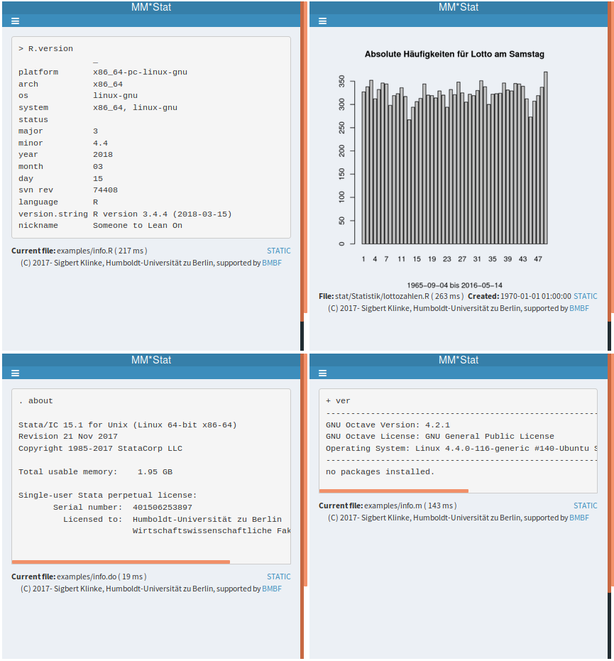
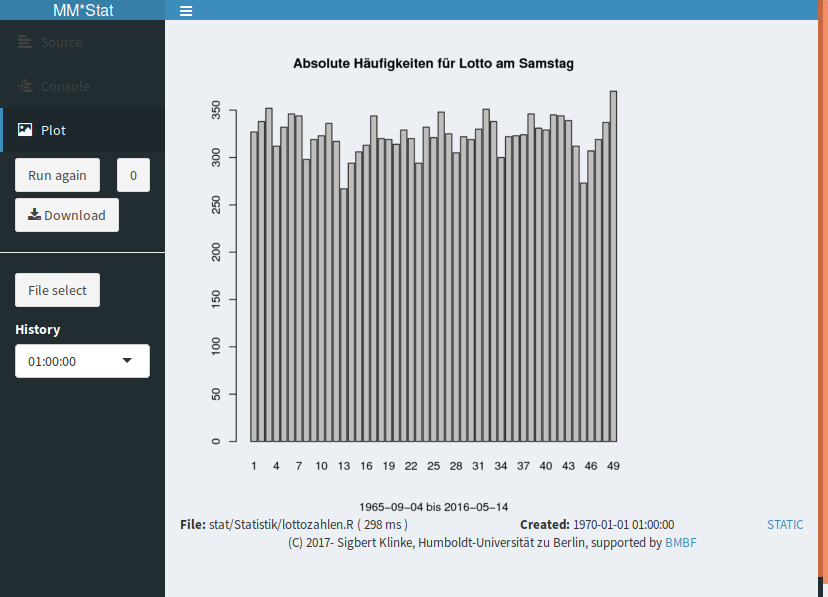
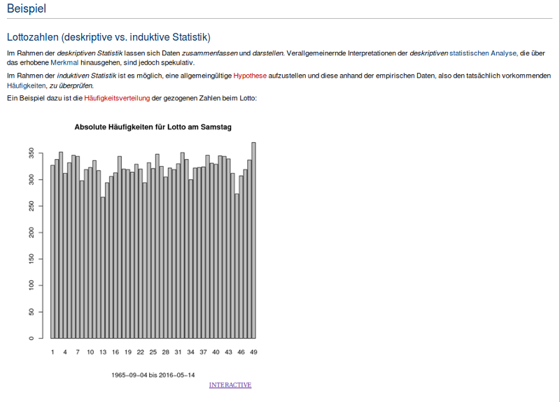
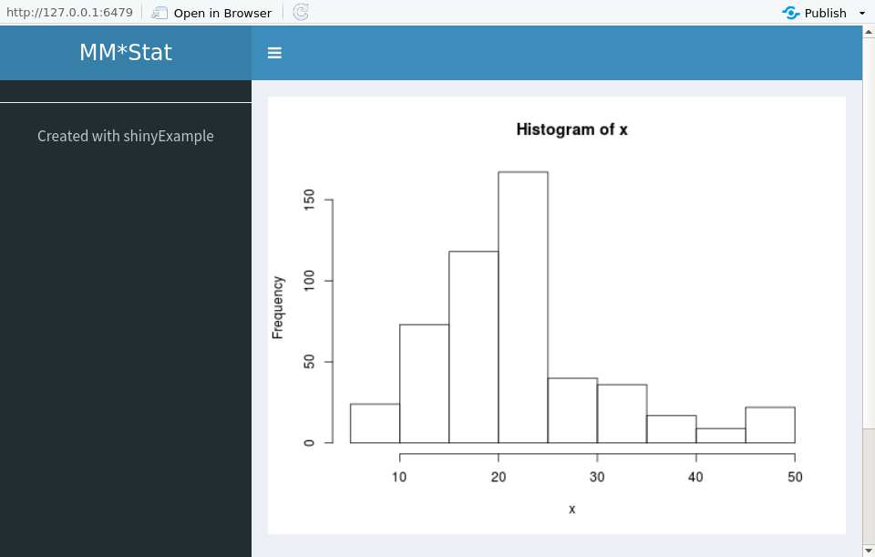
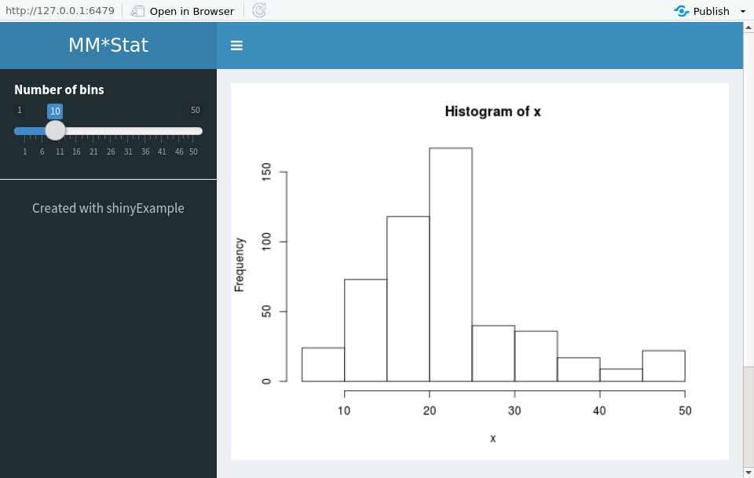
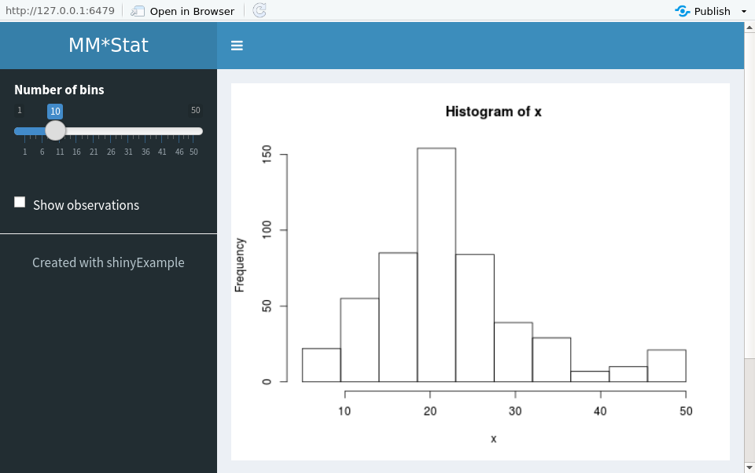

--- 
title: "shinyExample" 
author: "Sigbert Klinke" 
date: "`r format(Sys.time(), '%d %B, %Y')`"
output: 
  html_document:
    toc: true
vignette: > 
  %\VignetteIndexEntry{shinyExample} 
  %\VignetteEngine{knitr::rmarkdown} 
  \usepackage[utf8]{inputenc} 
---

```{r setup, include=FALSE}
knitr::opts_chunk$set(echo = TRUE)
```

## Installation from github

To install the package from GitHub use the [devtools package](https://cran.r-project.org/package=devtools):

> devtools::install_github('sigbertklinke/shinyExample')

__Notes__:

1. To use the Shiny app you need to have installed [Ghostscript](https://www.ghostscript.com/) and [ImageMagick](https://www.imagemagick.org) before.
2. The app may not work on Windows systems.

## shinyExample

*shinyExample* allows you to run R-, Octave- of Stata programs which produce only console output or one plot. For teaching purposes the source coude, the console output and the plot can be viewed. The app supports some limited interactivity: you can rerun the program which is especially in the framework of inferential statistics useful to show the influence of drawing a new (random) sample.  



### Interactive app

Clicking on the  opens a sidebar which allows further operations.

* __Source__ : view source code
* __Console__ : view console output (including source code)
* __Plot__ : view plot output (if any)
* __Run again__ : rerun current program, the result will have an embedded a time stamp of the current time
* __0__ : rerun current program, the result will have an embedded a time stamp of '0' (= 1:00:00, 1 Jan 1970)
* __Download__ : download the source code (TXT), the console output (TXT) or the plot (PDF) depending on the current view 
* __File select__ : select another program stored at the server
* __History__ : load the result from a previous run of the current program



The Shiny app will run in R (via `runShinyExample()`), but of course is intended to be embedded via an *iframe* into web pages. With URL given you can determine the starting parameters of the app. The URL

https://shinyapps.wiwi.hu-berlin.de/examples?P=stat/Statistik/lottozahlen.R&V=P

forces the example app to open the given program (assumed it exists on the server) and to show the plot window. For *MediaWiki* exists the [Iframe extension](https://www.mediawiki.org/wiki/Extension:Iframe) to embed the app.

Following query parameters exists

* *P=* path and name of program to run
    + *xxx.R* denotes a [R](https://www.r-project.org/) program
    + *xxx.m* denotes a [Octave](https://www.gnu.org/software/octave/) program
    + *xxx.do* denotes a [Stata](https://www.stata.com/) progfamm
* *V=* view of program result with three possible values: *Source*, *Console* or *Plot*
* *W=* width of plot (in pixel, default: 800)
* *H=* height of plot (in pixel, default: 600)
* *S=* some sizenames for the plot, e.g. *VGA* for 640x480. Note that seting *W* and/or *H* overwrites the settings from *S* 
* *L=* link to an specific version of output (if not given *L=0000000000000* is assumed) 

### Static app

Since each run of a program creates a set of HTML pages you can also embed these HTML pages rather the app itself. In web page you should not embed more than __four__ apps, otherwise the server will not be able to display empty results. If you once made a program which produced a good plot or output then can click on __STATIC__ link to get the URL for this plot or output. If you embed that link into your webpage then you will this HTML page with __INTERACTIVE__ link to the app.



### Installing the app on a Shiny server

1. You copy everything under *inst/examples* into a shiny apps directoy of the server, e.g. */srv/shiny-server/examples*
2. The subdirectories *rds*, *run* and *tmp* should be writetable for the Shiny server. 
3. Place all necessary data files your example programs might need into the subdirectory *run*
3. The subdirectory *R* contains your example programs, maybe with a further subdirectory structure.

## makeShinyApp

The <tt>makeShinyApp</tt> command should allow you to create easily an interactive app. You may have R code snippets which you use to show in your presentations. Note that this intended to convert quickly programm snippets to an interactive shiny app. For complex apps it is better to use  <tt>shiny</tt> directly.

### The histogram example

#### A base histogram

A typical code snippet which simply shows a histogram might be (stored in a file called <tt>hist0.R</tt>)

__hist0.R__
```{r eval=FALSE}
library("MASS")
x <- Boston$medv
hist(x)
```

The first step is to create a file, e.g. named <tt>hist0_app.R</tt> which contains the app environment. Do not forget to set your working directory to the directory where <tt>hist0.R</tt> is stored.

__hist0_app.R__
```{r eval=FALSE}
library("shinyExample")
makeShinyApp(output=plotOut('plot', file='hist0.R'))
```

The <tt>output</tt> parameter tells Shiny that you have one output element named <tt>plot</tt> which contains a plot (<tt>plotOut</tt>). The code to generate the plot is contained in your file <tt>hist0.R</tt>.

Running this R program will generate and open in RStudio a file named <tt>app.R</tt>. Running the app with the __Run app__ button will run your app


#### A histogram with bins

The standdard example in Shiny is a histogram where the number of bins can be modified for the data set. We need to create an input element which allows us to modify the number of breaks.

__hist1.R__
```{r eval=FALSE}
library("MASS")
x <- Boston$medv
hist(x, breaks=value(input$breaks))
```

We will name the input elements <tt>breaks</tt>. If you create an shiny app then you will become the current value of the input element by <tt>input$breaks</tt>. The function <tt>value</tt> ensures that you always get a valid value; during an initialisation of an Shiny app it happens that <tt>input$breaks</tt> is <tt>NULL</tt>. 

__hist1_app.R__
```{r eval=FALSE}
library("shinyExample")
elem <- sliderIn('breaks', 'Number of bins', min=1, max=50, value=10)
makeShinyApp(input=elem,
             output=plotOut('plot', file='hist1.R'))
```

<tt>elem</tt> contains the slider with name <tt>breaks</tt> which is later used for <tt>input$breaks</tt>. To the call of <tt>makeShinyApp</tt>
we add now this input elements. 



Looking at the histogram you will notice that we have only 9 bins instead of 10 bins as the slider says. When playing with the number of bins it seems that sometimes the histogram does not react on your changes. This is a problem of <tt>hist</tt> which modifies your value of <tt>breaks</tt> to a nearby value. For getting exactly <tt>input$breaks</tt> bins you have to set class borders explicitly.

__hist2.R__
```{r eval=FALSE}
library("MASS")
x <- Boston$medv
b <- seq(min(x), max(x), length.out=value(input$breaks)+1)
hist(x, breaks=b)
```

__hist2_app.R__
```{r eval=FALSE}
library("shinyExample")
elem <- sliderIn('breaks', 'Number of bins', min=1, max=50, value=10)
makeShinyApp(input=elem,
             output=plotOut('plot', file='hist2.R'))
```

Now you really get 10 bins for your histogram


When running your app in RStudio you see the following output

```{r eval=FALSE}
gettext("Number of bins"); # 1
```

Currently you can ignore this, but if you want internationalise your app then you need this information.

#### Rug your histogram

The standard Shiny example allows you to add the observations to your histogram, which requires two input elements

__hist3.R__
```{r eval=FALSE}
library("MASS")
x <- Boston$medv
b <- seq(min(x), max(x), length.out=value(input$breaks)+1)
hist(x, breaks=b)
if(value(input$rug)) rug(x)
```

Create yout input elements and combine them into a list

__hist3_app.R__
```{r eval=FALSE}
library("shinyExample")
elem1 <- sliderIn('breaks', 'Number of bins', min=1, max=50, value=10)
elem2 <- checkboxIn('rug', 'Show observations')
makeShinyApp(input=list(elem1, elem2),
             output=plotOut('plot', file='hist3.R'))
```



### Derived input elements

The following additional input elements exists

| Element | Derived from | Parameters | Further parameters |
| confidenceLevelIn | sliderIn | | percent 
 